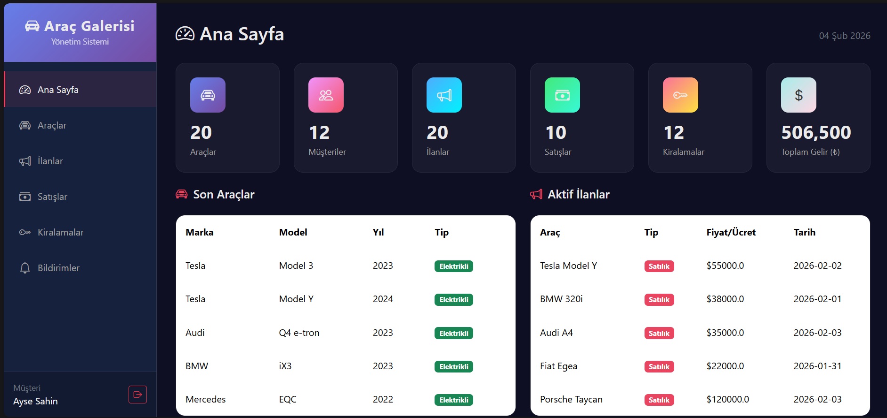
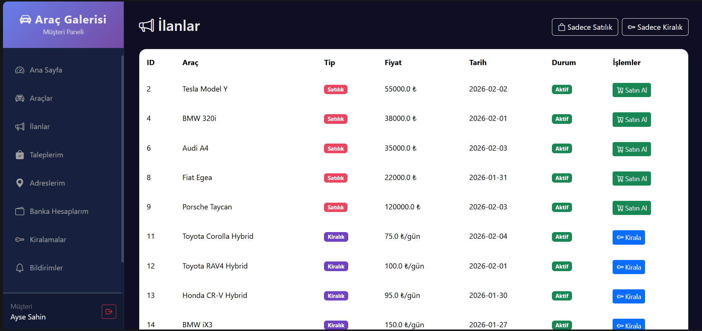
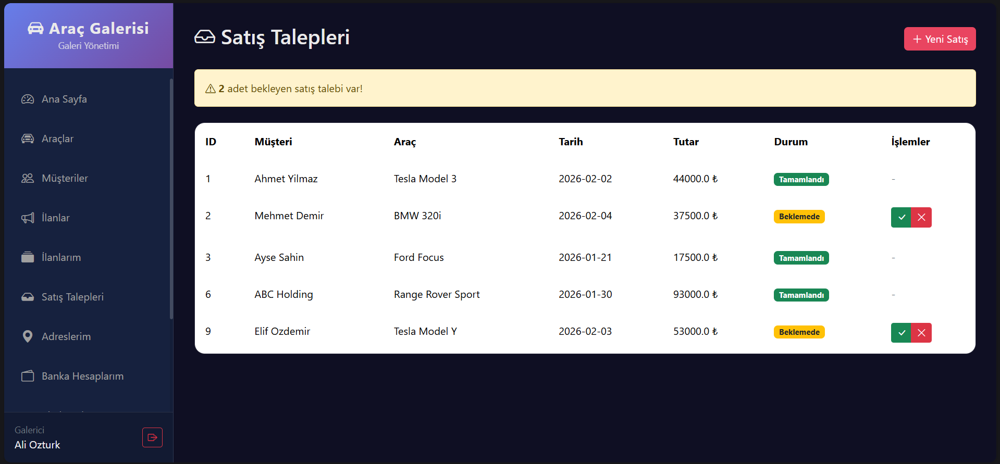

# 🚗 Araç Galeri Yönetim Sistemi
## Vehicle Gallery Management System

> **Veritabanı Yönetim Sistemleri Dersi Ortak Projesi**


---

## 📋 Proje Hakkında

Bu proje, **Veritabanı Yönetim Sistemleri** dersi kapsamında geliştirilmiş bir **Araç Galeri Yönetim Sistemi**'dir. Sistem, araç galerileri için satış, kiralama, müşteri yönetimi ve servis takibi gibi temel işlevleri kapsamlı bir şekilde yönetmektedir.

---

## � Ekran Görüntüleri

### Ana Sayfa


### Araç Listesi


### Satış İşlemleri


### Video

---

## 🎯 Proje Amaçları

- ✅ Veritabanı tasarımı ve normalizasyon ilkelerinin uygulanması
- ✅ SQL DDL ve DML komutlarının etkin kullanımı
- ✅ Trigger, Stored Procedure ve View gibi veritabanı nesnelerinin implementasyonu
- ✅ Spring Boot ile veritabanı entegrasyonu
- ✅ Katmanlı mimari (Controller-Service-Repository) uygulaması

---

## 🏗️ Sistem Mimarisi

```
┌─────────────────────────────────────────────────────────────┐
│                      Presentation Layer                     │
│                    (Thymeleaf Templates)                    │
├─────────────────────────────────────────────────────────────┤
│                      Controller Layer                       │
│  VehicleController, CustomerController, SaleController ...  │
├─────────────────────────────────────────────────────────────┤
│                       Service Layer                         │
│  VehicleService, CustomerService, SaleService, ...          │
├─────────────────────────────────────────────────────────────┤
│                      Repository Layer                       │
│      Spring Data JPA Repositories (CRUD Operations)         │
├─────────────────────────────────────────────────────────────┤
│                      Database Layer                         │
│                       PostgreSQL 15+                        │
└─────────────────────────────────────────────────────────────┘
```

---

## 📊 Veritabanı Şeması

### Ana Tablolar

| Tablo | Açıklama |
|-------|----------|
| `personnel` | Tüm kullanıcıların ana tablosu (kalıtım için üst sınıf) |
| `customers` | Müşteri bilgileri |
| `individual_customers` | Bireysel müşteriler |
| `corporate_customers` | Kurumsal müşteriler |
| `dealers` | Galerici/Satıcı bilgileri |
| `vehicles` | Araç bilgileri |
| `fuel_vehicles` | Yakıtlı araçlar |
| `electric_vehicles` | Elektrikli araçlar |
| `listings` | Satılık/Kiralık ilanlar |
| `sales` | Satış kayıtları |
| `rentals` | Kiralama kayıtları |
| `payments` | Ödeme işlemleri |
| `offers` | Teklif kayıtları |
| `service_records` | Servis geçmişi |
| `insurances` | Sigorta kayıtları |
| `bank_accounts` | Banka hesapları |
| `personnel_addresses` | Adres bilgileri |
| `audit_log` | Denetim günlüğü |

---

## ⚡ Veritabanı Özellikleri

### 🔷 Triggerlar (Tetikleyiciler)

| Trigger | Açıklama |
|---------|----------|
| `trg_deactivate_listing_on_sale` | Satış tamamlandığında ilanı otomatik deaktif eder |
| `trg_calculate_rental_cost` | Kiralama maliyetini otomatik hesaplar |
| `trg_update_vehicle_after_service` | Servis kaydında bildirim oluşturur |
| `trg_create_sale_on_offer_accepted` | Teklif kabul edildiğinde satış oluşturur |
| `trg_log_vehicle_changes` | Araç değişikliklerini audit log'a kaydeder |
| `trg_process_money_transfer` | Ödemelerde para transferi işler |

### 🔷 Stored Procedures (Saklı Prosedürler)

| Procedure | Açıklama |
|-----------|----------|
| `sp_create_sale` | Yeni satış oluşturur |
| `sp_create_rental` | Yeni kiralama oluşturur |
| `sp_process_payment` | Ödeme işlemi yapar |
| `sp_monthly_report` | Aylık rapor oluşturur |

### 🔷 Views (Görünümler)

| View | Açıklama |
|------|----------|
| `vw_active_listings` | Aktif ilanları gösterir |
| `vw_sales_summary` | Satış özetlerini gösterir |
| `vw_customer_rentals` | Müşteri kiralamalarını gösterir |
| `vw_vehicle_details` | Araç detaylarını gösterir |

### 🔷 Kısıtlamalar (Constraints)

- **CHECK Constraints**: Veri bütünlüğünü sağlayan 20+ kontrol kısıtı
- **FOREIGN KEY Constraints**: Tablo ilişkilerini tanımlayan yabancı anahtar kısıtları
- **UNIQUE Constraints**: Tekil değerleri garanti eden benzersizlik kısıtları

---

## 🛠️ Teknoloji Yığını

### Backend
- **Java 17** - Programlama dili
- **Spring Boot 3.2.0** - Uygulama framework'ü
- **Spring Data JPA** - Veritabanı erişim katmanı
- **Hibernate** - ORM (Object-Relational Mapping)
- **Lombok** - Boilerplate kod azaltma

### Frontend
- **Thymeleaf** - Server-side template engine
- **HTML5/CSS3** - Arayüz geliştirme
- **Bootstrap** - UI framework

### Veritabanı
- **PostgreSQL 15+** - İlişkisel veritabanı yönetim sistemi

### Geliştirme Araçları
- **Maven** - Bağımlılık yönetimi
- **IntelliJ IDEA** - IDE
- **Git** - Versiyon kontrol

---

## 🚀 Kurulum

### Gereksinimler

- Java JDK 17 veya üzeri
- PostgreSQL 15 veya üzeri
- Maven 3.8 veya üzeri

### Veritabanı Kurulumu

1. PostgreSQL'de yeni bir veritabanı oluşturun:
```sql
CREATE DATABASE vehiclegallery;
```

2. DDL script'ini çalıştırın:
```bash
psql -U postgres -d vehiclegallery -f database_init.sql
```

### Uygulama Kurulumu

1. Projeyi klonlayın:
```bash
git clone <repository-url>
cd VehicleGallery
```

2. `application.properties` dosyasını yapılandırın:
```properties
spring.datasource.url=jdbc:postgresql://localhost:5432/vehiclegallery
spring.datasource.username=your_username
spring.datasource.password=your_password
```

3. Uygulamayı başlatın:
```bash
./mvnw spring-boot:run
```

4. Tarayıcıda açın:
```
http://localhost:8080
```

---

## 📁 Proje Yapısı

```
VehicleGallery/
├── src/
│   ├── main/
│   │   ├── java/com/vehiclegallery/
│   │   │   ├── config/          # Yapılandırma sınıfları
│   │   │   ├── controller/      # REST/MVC Controller'lar
│   │   │   ├── entity/          # JPA Entity sınıfları
│   │   │   ├── repository/      # Spring Data JPA Repository'ler
│   │   │   ├── service/         # İş mantığı servisleri
│   │   │   └── util/            # Yardımcı sınıflar
│   │   └── resources/
│   │       ├── templates/       # Thymeleaf şablonları
│   │       ├── static/          # CSS, JS, resimler
│   │       └── application.properties
│   └── test/                    # Test sınıfları
├── database_init.sql            # Veritabanı DDL/DML script'i
├── pom.xml                      # Maven yapılandırması
└── README.md
```

---

## 📝 Özellikler

### 👤 Kullanıcı Yönetimi
- Bireysel ve kurumsal müşteri kayıt/güncelleme
- Galerici (Dealer) yönetimi
- Adres ve banka hesabı yönetimi

### 🚘 Araç Yönetimi
- Yakıtlı, elektrikli ve hibrit araç desteği
- Araç servis geçmişi takibi
- Sigorta kayıtları

### 📄 İlan Yönetimi
- Satılık ve kiralık ilan oluşturma
- İlan durumu takibi
- Otomatik ilan deaktifleştirme

### 💰 Satış & Kiralama
- Satış işlem yönetimi
- Kiralama süreci takibi
- Teklif alma ve değerlendirme

### 💳 Ödeme Sistemi
- Nakit, kredi kartı ve transfer desteği
- Otomatik bakiye güncelleme
- Ödeme geçmişi

### 📊 Raporlama
- Aylık satış raporları
- Araç detay görünümleri
- Denetim günlüğü (Audit Log)

---

## 🔐 Güvenlik

- Şifre hashleme (BCrypt)
- Input validasyonu
- SQL Injection koruması (Hazır ifadeler)

---

## 📚 Kaynaklar

- [Spring Boot Documentation](https://docs.spring.io/spring-boot/docs/current/reference/html/)
- [PostgreSQL Documentation](https://www.postgresql.org/docs/)
- [Thymeleaf Documentation](https://www.thymeleaf.org/documentation.html)

---

## 📄 Lisans

Bu proje eğitim amaçlı geliştirilmiştir ve MIT lisansı altında sunulmaktadır.

---

<div align="center">

**🎓 Veritabanı Yönetim Sistemleri Dersi - 2024/2025**

*Bu proje, veritabanı yönetim sistemleri kavramlarını pratik bir uygulama üzerinde deneyimlemek amacıyla geliştirilmiştir.*

</div>
